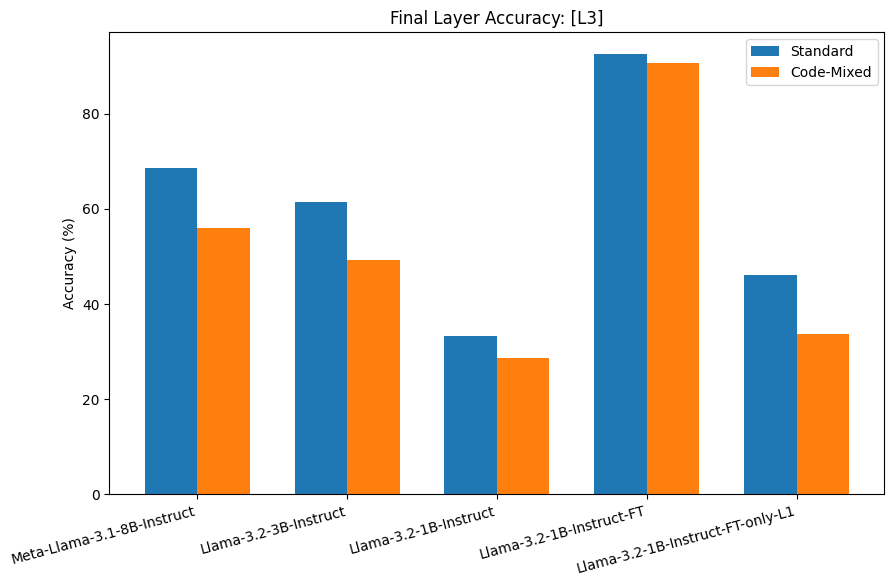
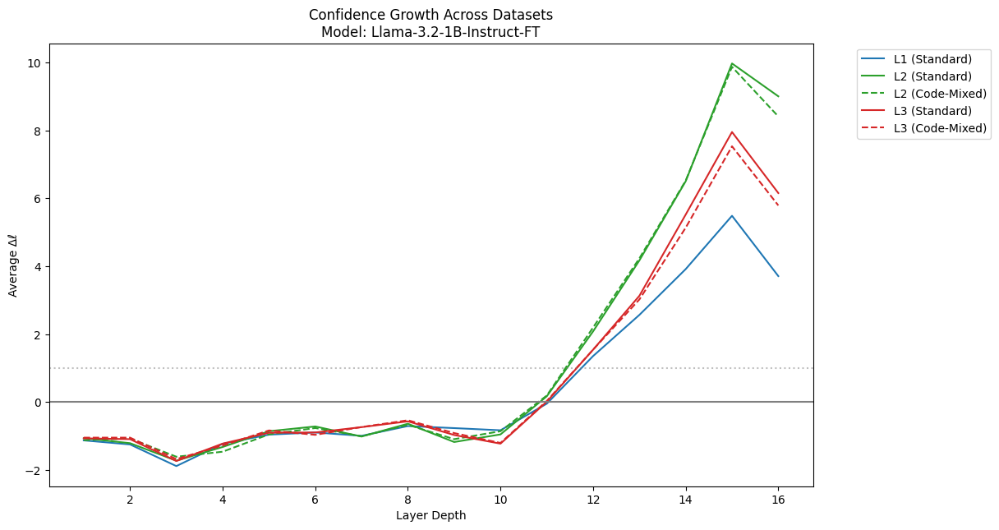
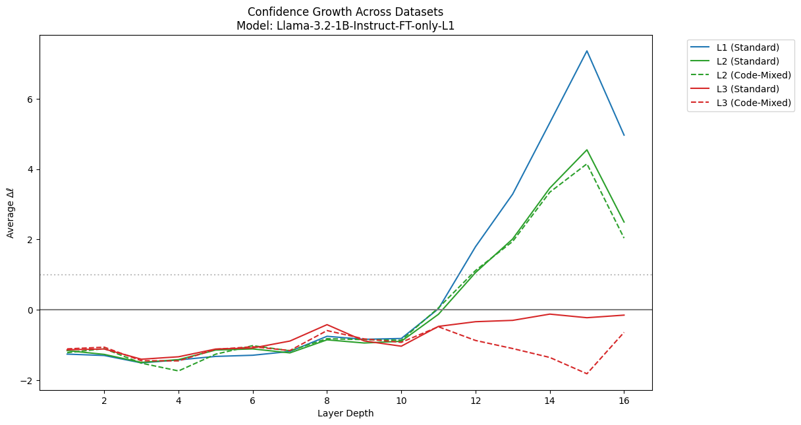

# Emergence of Code-Mixed Relational Reasoning in Small Language Models

## Project Overview

This repository investigates how Small Language Models (SLMs) process complex multi-entity and comparative reasoning, specifically when queried in code-mixed languages (e.g., English-Hindi/Bengali). 

We utilize the **Sanskriti Dataset** to evaluate whether SLMs rely purely on factual memorization or if they can execute structural reasoning. By tracking layer-wise confidence trajectories (emergence), we identify cognitive bottlenecks in base models and demonstrate how targeted LoRA adapters can mechanically inject structural routing without causing catastrophic forgetting.

---

## Dataset Formulation

To isolate reasoning from factual recall, we extracted cultural entities from the Sanskriti dataset and structurally transformed the base recall questions into three hierarchical cognitive levels:

* **L1: Factual Recall** (Direct retrieval from the dataset)
  * *Example:* "Where is the Outrigger canoe designs famous?" 
  * *Answer:* Nicobar district
* **L2: Multi-Entity Relational Reasoning** (Finding intersections)
  * *Example:* "Which region of Andaman_and_Nicobar is associated with both Hodi Craft and Outrigger canoe designs?"
  * *Correct:* Nicobar district
* **L3: Comparative & Elimination Reasoning** (Multi-hop logic)
  * *Example (Comparative):* "While Jarawa body painting is associated with South and Middle Andaman Islands, Hodi Craft is associated with which region?"
  * *Example (Elimination):* "Which of the following art forms is NOT associated with Nicobar district? (A) Hodi Craft, (B) Outrigger canoe designs, (C) Jarawa body painting."
  * *Correct:* Jarawa body painting

---

## Results & Analysis

The following table summarizes the final layer accuracy across the L1, L2, and L3 datasets for standard English and Code-Mixed (CM) variations.

| Model | L1 (Std) | L2 (Std) | L2 (CM) | L3 (Std) | L3 (CM) |
| :--- | :--- | :--- | :--- | :--- | :--- |
| **Meta-Llama-3.1-8B-Instruct** | 83.8% | 87.4% | 83.6% | 68.6% | 56.0% |
| **Llama-3.2-3B-Instruct** | 77.4% | 80.4% | 74.3% | 61.4% | 49.3% |
| **Llama-3.2-1B-Instruct (Base)** | 59.5% | 56.0% | 52.1% | 33.3% | 28.6% |
| **Llama-3.2-1B-Instruct-FT (Ours)** | **79.2%** | **99.4%** | **99.1%** | **92.5%** | **90.7%** |
| **Llama-3.2-1B-Instruct-FT-only-L1 (Ablation)**| 92.0% | 81.9% | 81.3% | 46.1% | 33.7% |

### Key Findings

1. **The Reasoning Bottleneck:** Base models show significant degradation when moving from L1 (Recall) to L3 (Comparative), especially under code-mixed constraints. 
2. **Success of Structural Fine-Tuning:** The `1B-Instruct-FT` model effectively overcomes this bottleneck, achieving >90% accuracy on L3 Code-Mixed tasks, vastly outperforming the 8B baseline.
3. **Proof of Structural Logic over Memorization (Ablation):** A common critique is that fine-tuning merely forces a model to memorize dataset entities rather than teaching it to reason. To test this, we trained an ablation model (`FT-only-L1`) strictly on 1-hop facts. While it achieved near-perfect factual recall (92%), its accuracy collapsed on comparative logic (33.7%). The confidence trajectories confirm that factual injection alone is insufficient; the full adapter successfully learned the cognitive routing required for multi-hop reasoning, not just vocabulary memorization.

---

## Visual Proof

### 1. Overcoming the Reasoning Bottleneck

### 2. Mechanistic Proof of Structural Reasoning

The confidence growth (Δℓ) across the 16 layers of the 1B model demonstrates that code-mixed logic perfectly maps to standard reasoning trajectories. The model translates syntax in layers 1-10, and executes structural reasoning in layers 11-15, proving it learned *how to think* rather than simply memorizing answers.

### 3. The Knowledge vs. Reasoning Ablation Study

When trained strictly on 1-hop facts (L1), the model achieves near-perfect accuracy on factual recall, but completely collapses on L3 comparative logic. This confirms that factual injection alone is insufficient; structural logic must be explicitly routed.

